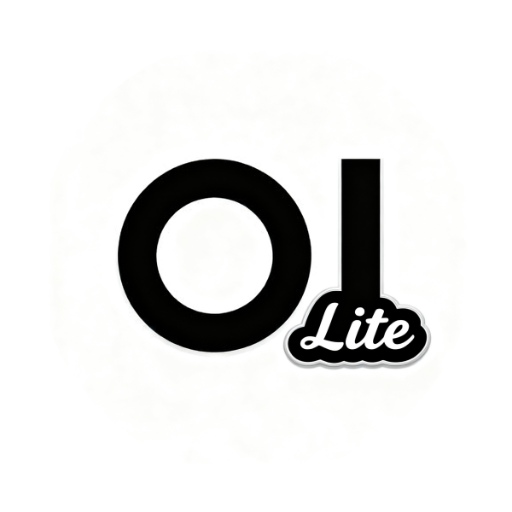
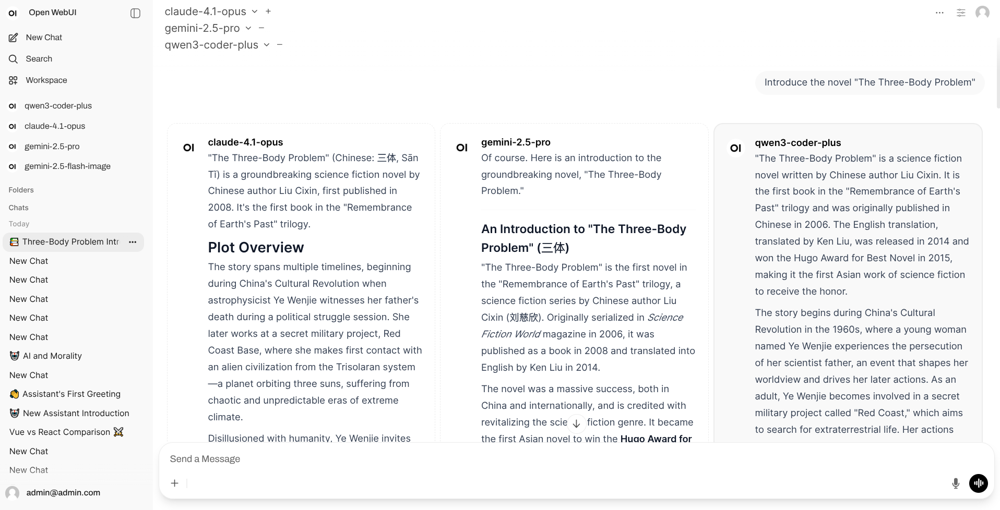

  

  <h1>
    Open WebUI Lite
  </h1>

[English](README.md) | [中文](README.zh.md)

Open WebUI Lite, a lightweight implementation of Open WebUI

> **⚠️ Early Development Stage**  
> This project is currently in early development. Only basic chat functionality is implemented at this time. Other features are being developed gradually.

## Features

- A desktop client with a single executable download to get started
- Use original frontend
- No Docker, Python, PostgreSQL, Redis dependencies required
- Lower memory footprint compared to original version (much lower)
- Lower hardware requirements compared to original version
- Better performance with Rust backend server compared to original version

## Download & Usage

Support Windows, macOS, Linux systems, and x86_64, aarch64 architectures.

Visit the [Releases](https://github.com/xxnuo/open-webui-lite/releases/latest) page to download the version for your system.

### Client Types

This project provides two **completely independent** clients. Choose based on your use case:

#### 1. Desktop Application

**Use Case**: Personal computer use with native window interface

**Features**:
- Ready to use out of the box
- Runs independently, no server required
- Native window experience

#### 2. Backend Server (CLI)

**Use Case**: Server deployment, access via web browser

**Features**:
- Command-line launch, access via browser
- Runs independently, no desktop client required
- Suitable for server deployment and multi-user access

### Usage Instructions

**Desktop Client**: Simply install and open the application

**Backend Server**:
1. Download the binary file for your system
2. Grant execute permission (Linux/macOS): `chmod +x open-webui-lite-*`
3. Run: `./open-webui-lite-*`
4. Access the displayed address in your browser (usually `http://localhost:8080`)

For detailed configuration options and environment variables, see [CLI Documentation](CLI.md).

## Dependencies

### Original Project

> [open-webui/open-webui](https://github.com/open-webui/open-webui)

### Rust Backend

> [knoxchat/open-webui-rust](https://github.com/knoxchat/open-webui-rust)

Based on [knox's](https://github.com/knoxchat) Rust backend

#### Changes:

- Add desktop client support
- Add SQLite database support
- Remove Postgres database dependencies
- Remove Redis dependencies

> You can support [knox's](https://github.com/knoxchat/open-webui-rust) backend development if you find it useful.
